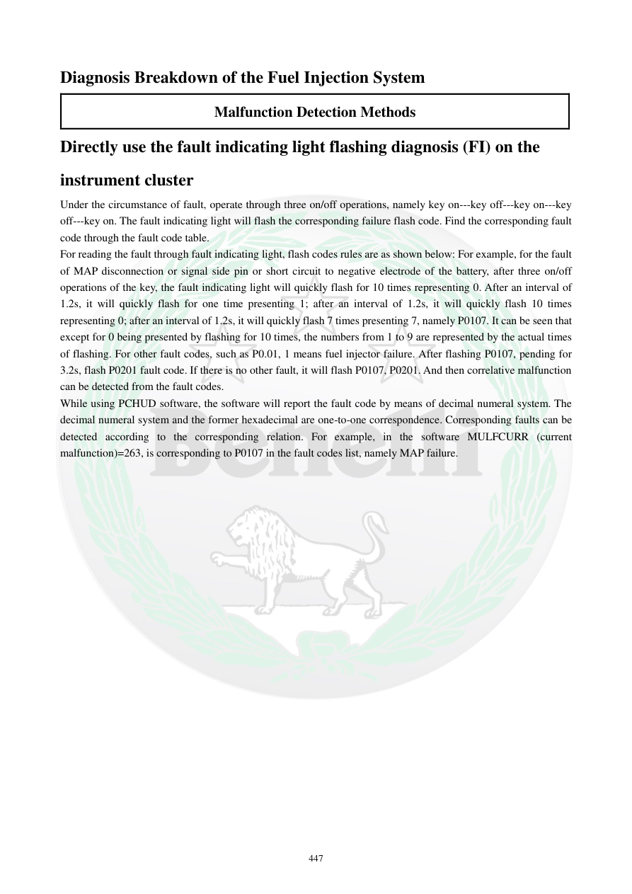

# Manual page 448

> Source: [page-0448.md](../source/page-0448.md)

## Page image / diagram

## Extracted text

# Source page 448

 
447 
Diagnosis Breakdown of the Fuel Injection System 
Malfunction Detection Methods 
Directly use the fault indicating light flashing diagnosis (FI) on the 
instrument cluster 
Under the circumstance of fault, operate through three on/off operations, namely key on---key off---key on---key 
off---key on. The fault indicating light will flash the corresponding failure flash code. Find the corresponding fault 
code through the fault code table.  
For reading the fault through fault indicating light, flash codes rules are as shown below: For example, for the fault 
of MAP disconnection or signal side pin or short circuit to negative electrode of the battery, after three on/off 
operations of the key, the fault indicating light will quickly flash for 10 times representing 0. After an interval of 
1.2s, it will quickly flash for one time presenting 1; after an interval of 1.2s, it will quickly flash 10 times 
representing 0; after an interval of 1.2s, it will quickly flash 7 times presenting 7, namely P0107. It can be seen that 
except for 0 being presented by flashing for 10 times, the numbers from 1 to 9 are represented by the actual times 
of flashing. For other fault codes, such as P0.01, 1 means fuel injector failure. After flashing P0107, pending for 
3.2s, flash P0201 fault code. If there is no other fault, it will flash P0107, P0201. And then correlative malfunction 
can be detected from the fault codes.  
While using PCHUD software, the software will report the fault code by means of decimal numeral system. The 
decimal numeral system and the former hexadecimal are one-to-one correspondence. Corresponding faults can be 
detected according to the corresponding relation. For example, in the software MULFCURR (current 
malfunction)=263, is corresponding to P0107 in the fault codes list, namely MAP failure.

## Persian notes

### تشخیص خطا با چراغ FI و کدهای چشمک‌زن
برای خواندن کد خطا از چراغ FI، طبق منبع سوئیچ را به ترتیب **ON → OFF → ON → OFF → ON** قرار دهید. سپس چراغ FI کد خطا را به‌صورت چشمک‌زن نمایش می‌دهد.

**روش خواندن کد:**
- عدد **0** با 10 بار چشمک نمایش داده می‌شود.
- اعداد 1 تا 9 با همان تعداد چشمک نمایش داده می‌شوند.
- بین ارقام کد، حدود **1.2 ثانیه** فاصله وجود دارد.
- مثال منبع: کد **P0107** به شکل 10 چشمک، 1 چشمک، 10 چشمک، 7 چشمک نمایش داده می‌شود.
- بعد از نمایش یک کد، حدود **3.2 ثانیه** مکث می‌شود و در صورت وجود خطای بعدی، کد بعدی نمایش داده می‌شود.

در نرم‌افزار PCHUD، کدها ممکن است به‌صورت عدد اعشاری نمایش داده شوند. منبع نمونه می‌زند که **MULFCURR=263** متناظر با **P0107** و خطای MAP است.

**نکته:** برای شمارش دقیق چشمک‌ها و ترتیب نمایش، تصویر/شماتیک منبع مرجع است.
