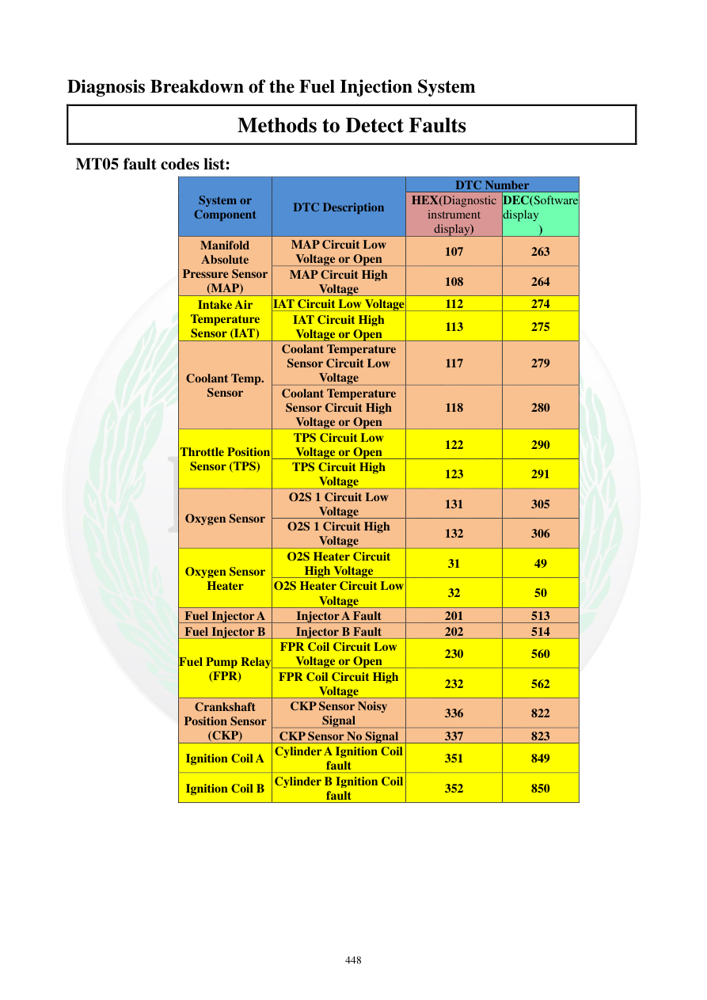

# Manual page 449

> Source: [page-0449.md](../source/page-0449.md)

## Page image / diagram

## Extracted text

# Source page 449

 
448 
Diagnosis Breakdown of the Fuel Injection System 
Methods to Detect Faults 
 MT05 fault codes list: 
 
 
 
System or 
Component 
DTC Description 
DTC Number 
HEX(Diagnostic 
instrument 
display) 
DEC(Software 
display  
) 
Manifold 
Absolute 
Pressure Sensor 
(MAP) 
MAP Circuit Low 
Voltage or Open 
107 
263 
MAP Circuit High 
Voltage 
108 
264 
Intake Air 
Temperature 
Sensor (IAT) 
IAT Circuit Low Voltage 
112 
274 
IAT Circuit High 
Voltage or Open 
113 
275 
Coolant Temp. 
Sensor 
Coolant Temperature 
Sensor Circuit Low 
Voltage 
117 
279 
Coolant Temperature 
Sensor Circuit High 
Voltage or Open 
118 
280 
Throttle Position 
Sensor (TPS) 
TPS Circuit Low 
Voltage or Open 
122 
290 
TPS Circuit High 
Voltage 
123 
291 
Oxygen Sensor 
O2S 1 Circuit Low 
Voltage 
131 
305 
O2S 1 Circuit High 
Voltage 
132 
306 
Oxygen Sensor 
Heater 
O2S Heater Circuit 
High Voltage 
31 
49 
O2S Heater Circuit Low 
Voltage 
32 
50 
Fuel Injector A 
Injector A Fault 
201 
513 
Fuel Injector B 
Injector B Fault 
202 
514 
Fuel Pump Relay 
(FPR) 
FPR Coil Circuit Low 
Voltage or Open 
230 
560 
FPR Coil Circuit High 
Voltage 
232 
562 
Crankshaft 
Position Sensor 
(CKP) 
CKP Sensor Noisy 
Signal 
336 
822 
CKP Sensor No Signal 
337 
823 
Ignition Coil A Cylinder A Ignition Coil 
fault 
351 
849 
Ignition Coil B Cylinder B Ignition Coil 
fault 
352 
850

## Persian notes

<!-- Persian translation/explanation will be added here. -->
