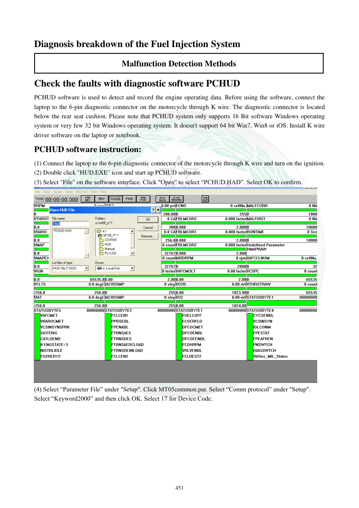

# Manual page 452

> Source: [page-0452.md](../source/page-0452.md)

## Page image / diagram

- [page-0452-img-01.png](../images/embedded/page-0452-img-01.png)

## Extracted text

# Source page 452

 
451 
Diagnosis breakdown of the Fuel Injection System 
Malfunction Detection Methods 
Check the faults with diagnostic software PCHUD 
PCHUD software is used to detect and record the engine operating data. Before using the software, connect the 
laptop to the 6-pin diagnostic connector on the motorcycle through K wire. The diagnostic connector is located 
below the rear seat cushion. Please note that PCHUD system only supports 16 Bit software Windows operating 
system or very few 32 bit Windows operating system. It doesn't support 64 bit Win7, Win8 or iOS. Install K wire 
driver software on the laptop or notebook.  
PCHUD software instruction: 
(1) Connect the laptop to the 6-pin diagnostic connector of the motorcycle through K wire and turn on the ignition.  
(2) Double click "HUD.EXE" icon and start up PCHUD software.  
(3) Select "File" on the software interface. Click "Open" to select “PCHUD.HAD”. Select OK to confirm.  
 
(4) Select “Parameter File” under "Setup". Click MT05common.par. Select “Comm protocol” under "Setup". 
Select “Keyword2000” and then click OK. Select 17 for Device Code.

## Persian notes

### نرم‌افزار PCHUD و اتصال به ECU
طبق منبع، PCHUD برای خواندن و ثبت داده‌های عملکرد موتور استفاده می‌شود.

**اتصال:**
- لپ‌تاپ از طریق کابل **K-wire** به کانکتور دیاگ 6 پین موتورسیکلت متصل می‌شود.
- کانکتور دیاگ زیر زین عقب قرار دارد.
- منبع محدودیت قدیمی نرم‌افزار را ذکر می‌کند: پشتیبانی از Windows 16-bit و تعداد محدودی Windows 32-bit، و عدم پشتیبانی از Windows 64-bit و iOS. این بخش مربوط به نرم‌افزار/سیستم‌های قدیمی همان زمان است.

**راه‌اندازی طبق منبع:**
1. K-wire را به کانکتور 6 پین وصل و سوئیچ را روشن کنید.
2. فایل **HUD.EXE** را اجرا کنید.
3. از File، فایل **PCHUD.HAD** را باز کنید.
4. در Setup → Parameter File، فایل **MT05common.par** را انتخاب کنید.
5. در Setup → Comm protocol، گزینه **Keyword2000** را انتخاب کنید.
6. Device Code را روی **17** قرار دهید.

به دلیل قدیمی بودن نرم‌افزار، این تنظیمات باید به‌عنوان مشخصات منبع اصلی در نظر گرفته شوند، نه الزاماً روش سازگار با سیستم‌های امروزی.
