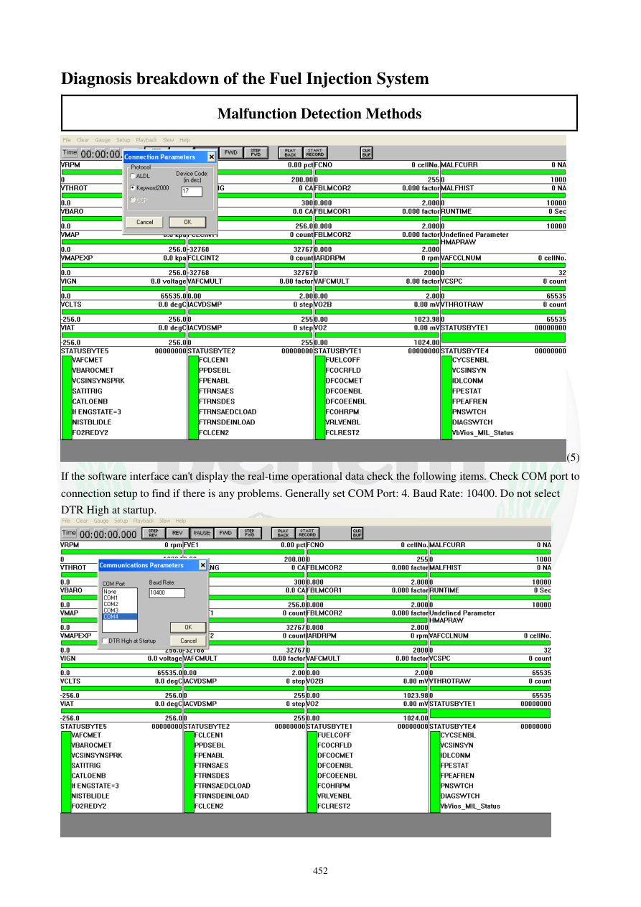

# Manual page 453

> Source: [page-0453.md](../source/page-0453.md)

## Page image / diagram

- [page-0453-img-01.png](../images/embedded/page-0453-img-01.png)

- [page-0453-img-02.png](../images/embedded/page-0453-img-02.png)

## Extracted text

# Source page 453

 
452 
Diagnosis breakdown of the Fuel Injection System 
Malfunction Detection Methods 
(5) 
If the software interface can't display the real-time operational data check the following items. Check COM port to 
connection setup to find if there is any problems. Generally set COM Port: 4. Baud Rate: 10400. Do not select 
DTR High at startup.

## Persian notes

### تنظیم ارتباط PCHUD
اگر نرم‌افزار داده‌های لحظه‌ای موتور را نمایش نمی‌دهد، ابتدا تنظیمات ارتباطی را بررسی کنید.

طبق منبع:
- **COM Port: 4**
- **Baud Rate: 10400**
- گزینه **DTR High at startup** نباید انتخاب شود.

اگر داده زنده نمایش داده نشد، اتصال و تنظیم پورت ارتباطی باید دوباره بررسی شود. این مقادیر تنظیم پیش‌فرض پیشنهادی منبع هستند و در رایانه‌های مختلف ممکن است شماره COM متفاوت باشد.
