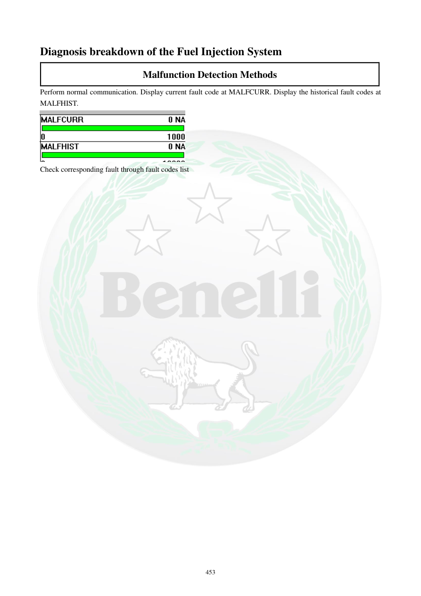

# Manual page 454

> Source: [page-0454.md](../source/page-0454.md)

## Page image / diagram

- [page-0454-img-01.png](../images/embedded/page-0454-img-01.png)

## Extracted text

# Source page 454

 
453 
Diagnosis breakdown of the Fuel Injection System 
Malfunction Detection Methods 
Perform normal communication. Display current fault code at MALFCURR. Display the historical fault codes at 
MALFHIST.  
 
Check corresponding fault through fault codes list

## Persian notes

<!-- Persian translation/explanation will be added here. -->
