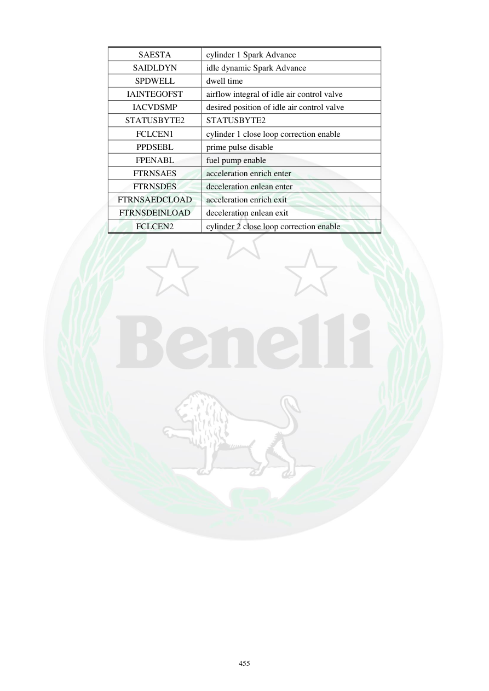

# Manual page 456

> Source: [page-0456.md](../source/page-0456.md)

## Page image / diagram

## Extracted text

# Source page 456

 
455 
SAESTA 
cylinder 1 Spark Advance 
SAIDLDYN 
idle dynamic Spark Advance 
SPDWELL 
dwell time 
IAINTEGOFST 
airflow integral of idle air control valve 
IACVDSMP 
desired position of idle air control valve 
STATUSBYTE2 
STATUSBYTE2 
FCLCEN1 
cylinder 1 close loop correction enable 
PPDSEBL 
prime pulse disable 
FPENABL 
fuel pump enable 
FTRNSAES 
acceleration enrich enter 
FTRNSDES 
deceleration enlean enter 
FTRNSAEDCLOAD 
acceleration enrich exit 
FTRNSDEINLOAD 
deceleration enlean exit 
FCLCEN2 
cylinder 2 close loop correction enable

## Persian notes

<!-- Persian translation/explanation will be added here. -->
