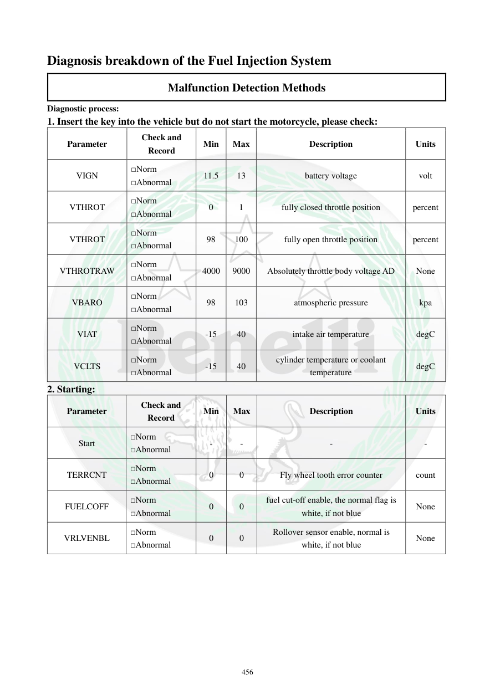

# Manual page 457

> Source: [page-0457.md](../source/page-0457.md)

## Page image / diagram

## Extracted text

# Source page 457

 
456 
Diagnosis breakdown of the Fuel Injection System 
Malfunction Detection Methods 
Diagnostic process:  
1. Insert the key into the vehicle but do not start the motorcycle, please check: 
Parameter 
Check and 
Record 
Min 
Max 
Description 
Units 
VIGN 
□Norm 
□Abnormal 
11.5 
13 
battery voltage 
volt 
VTHROT 
□Norm 
□Abnormal 
0 
1 
fully closed throttle position 
percent 
VTHROT 
□Norm 
□Abnormal 
98 
100 
fully open throttle position 
percent 
VTHROTRAW 
□Norm 
□Abnormal 
4000 
9000 
Absolutely throttle body voltage AD 
None 
VBARO 
□Norm 
□Abnormal 
98 
103 
atmospheric pressure 
kpa 
VIAT 
□Norm 
□Abnormal 
-15 
40 
intake air temperature 
degC 
VCLTS 
□Norm 
□Abnormal 
-15 
40 
cylinder temperature or coolant 
temperature 
degC 
2. Starting: 
Parameter 
Check and 
Record 
Min 
Max 
Description 
Units 
Start 
□Norm 
□Abnormal 
- 
- 
- 
- 
TERRCNT 
□Norm 
□Abnormal 
0 
0 
Fly wheel tooth error counter 
count 
FUELCOFF 
□Norm 
□Abnormal 
0 
0 
fuel cut-off enable, the normal flag is 
white, if not blue 
None 
VRLVENBL 
□Norm 
□Abnormal 
0 
0 
Rollover sensor enable, normal is 
white, if not blue 
None

## Persian notes

<!-- Persian translation/explanation will be added here. -->
