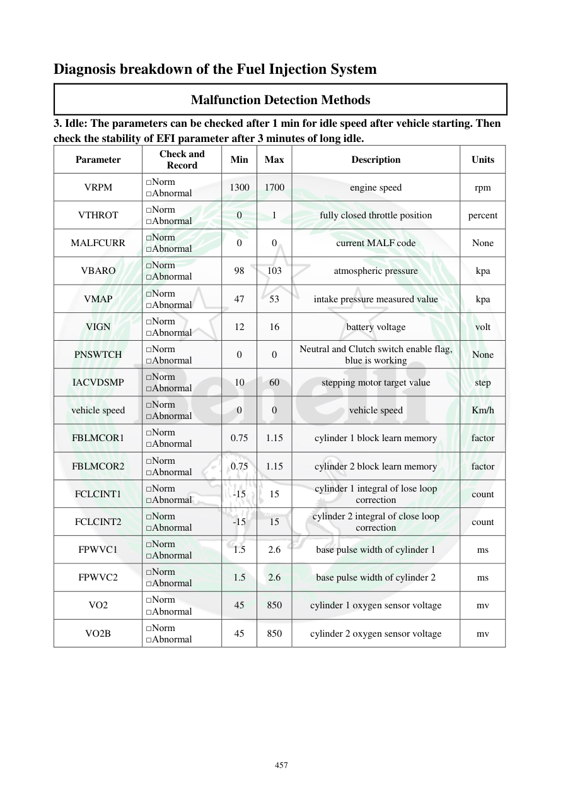

# Manual page 458

> Source: [page-0458.md](../source/page-0458.md)

## Page image / diagram

## Extracted text

# Source page 458

 
457 
Diagnosis breakdown of the Fuel Injection System 
Malfunction Detection Methods 
3. Idle: The parameters can be checked after 1 min for idle speed after vehicle starting. Then 
check the stability of EFI parameter after 3 minutes of long idle.  
Parameter 
Check and 
Record 
Min 
Max 
Description 
Units 
VRPM 
□Norm 
□Abnormal 
1300 
1700 
engine speed 
rpm 
VTHROT 
□Norm 
□Abnormal 
0 
1 
fully closed throttle position 
percent 
MALFCURR 
□Norm 
□Abnormal 
0 
0 
current MALF code 
None 
VBARO 
□Norm 
□Abnormal 
98 
103 
atmospheric pressure 
kpa 
VMAP 
□Norm 
□Abnormal 
47 
53 
intake pressure measured value 
kpa 
VIGN 
□Norm 
□Abnormal 
12 
16 
battery voltage 
volt 
PNSWTCH 
□Norm 
□Abnormal 
0 
0 
Neutral and Clutch switch enable flag, 
blue is working 
None 
IACVDSMP 
□Norm 
□Abnormal 
10 
60 
stepping motor target value 
step 
vehicle speed 
□Norm 
□Abnormal 
0 
0 
vehicle speed 
Km/h 
FBLMCOR1 
□Norm 
□Abnormal 
0.75 
1.15 
cylinder 1 block learn memory 
factor 
FBLMCOR2 
□Norm 
□Abnormal 
0.75 
1.15 
cylinder 2 block learn memory 
factor 
FCLCINT1 
□Norm 
□Abnormal 
-15 
15 
cylinder 1 integral of lose loop 
correction 
count 
FCLCINT2 
□Norm 
□Abnormal 
-15 
15 
cylinder 2 integral of close loop 
correction 
count 
FPWVC1 
□Norm 
□Abnormal 
1.5 
2.6 
base pulse width of cylinder 1 
ms 
FPWVC2 
□Norm 
□Abnormal 
1.5 
2.6 
base pulse width of cylinder 2 
ms 
VO2 
□Norm 
□Abnormal 
45 
850 
cylinder 1 oxygen sensor voltage 
mv 
VO2B 
□Norm 
□Abnormal 
45 
850 
cylinder 2 oxygen sensor voltage 
mv

## Persian notes

### بررسی پارامترهای EFI در دور آرام
پس از روشن شدن موتور، طبق منبع پارامترها را بعد از حدود **1 دقیقه** در دور آرام بررسی کنید و پس از **3 دقیقه** کارکرد طولانی درجا، پایداری پارامترهای EFI را ارزیابی کنید.

مقادیر مرجع:
- دور موتور VRPM: **1300 تا 1700 rpm**
- دریچه گاز بسته VTHROT: **0 تا 1%**
- کد خطای فعلی MALFCURR: **0**
- فشار اتمسفر VBARO: **98 تا 103 kPa**
- فشار ورودی VMAP: **47 تا 53 kPa**
- ولتاژ باتری VIGN: **12 تا 16V**
- وضعیت خلاص/کلاچ PNSWTCH: **0**
- مقدار هدف موتور پله‌ای IACVDSMP: **10 تا 60 step**
- سرعت خودرو: **0 km/h**
- ضریب یادگیری سیلندر 1 و 2: **0.75 تا 1.15**
- اصلاح حلقه‌بسته FCLCINT1/2: **15- تا 15**
- پهنای پالس پایه FPWVC1/2: **1.5 تا 2.6 ms**
- ولتاژ O2 سیلندرهای 1 و 2: **45 تا 850 mV**

اگر مقدار خارج از محدوده باشد، باید همان پارامتر و مدار/سنسور مرتبط بررسی شود.
