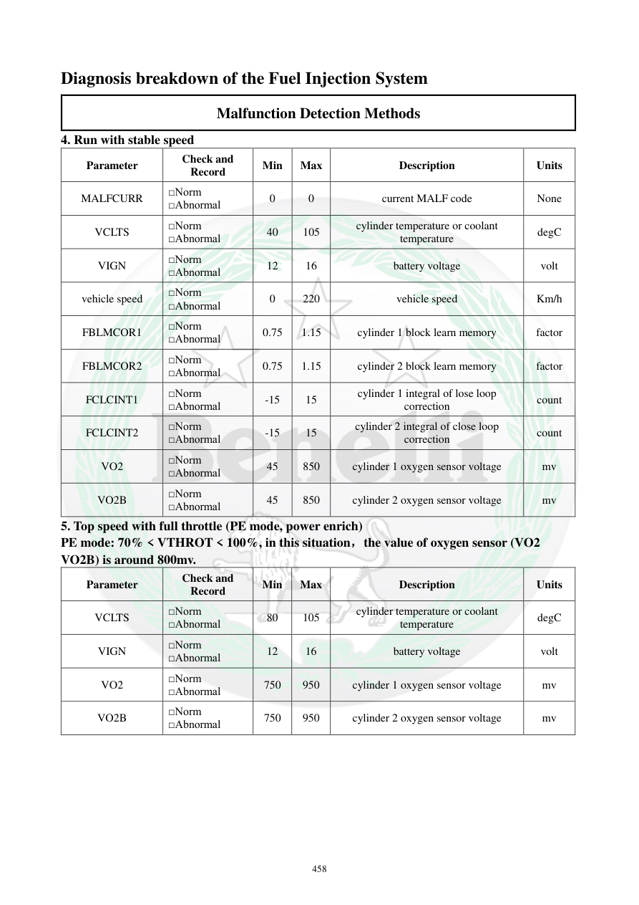

# Manual page 459

> Source: [page-0459.md](../source/page-0459.md)

## Page image / diagram

## Extracted text

# Source page 459

 
458 
Diagnosis breakdown of the Fuel Injection System 
Malfunction Detection Methods 
4. Run with stable speed  
Parameter 
Check and 
Record 
Min 
Max 
Description 
Units 
MALFCURR 
□Norm 
□Abnormal 
0 
0 
current MALF code 
None 
VCLTS 
□Norm 
□Abnormal 
40 
105 
cylinder temperature or coolant 
temperature 
degC 
VIGN 
□Norm 
□Abnormal 
12 
16 
battery voltage 
volt 
vehicle speed 
□Norm 
□Abnormal 
0 
220 
vehicle speed 
Km/h 
FBLMCOR1 
□Norm 
□Abnormal 
0.75 
1.15 
cylinder 1 block learn memory 
factor 
FBLMCOR2 
□Norm 
□Abnormal 
0.75 
1.15 
cylinder 2 block learn memory 
factor 
FCLCINT1 
□Norm 
□Abnormal 
-15 
15 
cylinder 1 integral of lose loop 
correction 
count 
FCLCINT2 
□Norm 
□Abnormal 
-15 
15 
cylinder 2 integral of close loop 
correction 
count 
VO2 
□Norm 
□Abnormal 
45 
850 
cylinder 1 oxygen sensor voltage 
mv 
VO2B 
□Norm 
□Abnormal 
45 
850 
cylinder 2 oxygen sensor voltage 
mv 
5. Top speed with full throttle (PE mode, power enrich)  
PE mode: 70% < VTHROT < 100%, in this situation，the value of oxygen sensor (VO2 
VO2B) is around 800mv.  
Parameter 
Check and 
Record 
Min 
Max 
Description 
Units 
VCLTS 
□Norm 
□Abnormal 
80 
105 
cylinder temperature or coolant 
temperature 
degC 
VIGN 
□Norm 
□Abnormal 
12 
16 
battery voltage 
volt 
VO2 
□Norm 
□Abnormal 
750 
950 
cylinder 1 oxygen sensor voltage 
mv 
VO2B 
□Norm 
□Abnormal 
750 
950 
cylinder 2 oxygen sensor voltage 
mv

## Persian notes

### بررسی در دور ثابت و تمام‌گاز
**دور ثابت:**
- کد خطای فعلی MALFCURR: **0**
- دمای موتور/مایع خنک‌کننده: **40 تا 105°C**
- ولتاژ باتری: **12 تا 16V**
- سرعت خودرو: **0 تا 220 km/h**
- ضریب یادگیری هر دو سیلندر: **0.75 تا 1.15**
- اصلاح حلقه‌بسته هر دو سیلندر: **15- تا 15**
- ولتاژ O2 هر دو سیلندر: **45 تا 850 mV**

**تمام‌گاز، حالت PE (غنی‌سازی توان):**
- محدوده دریچه گاز: **بیش از 70% تا 100%**
- دمای موتور: **80 تا 105°C**
- ولتاژ باتری: **12 تا 16V**
- ولتاژ O2 هر دو سیلندر: **750 تا 950 mV**
- منبع توضیح می‌دهد که در PE مقدار O2 حدود **800 mV** است.

این اعداد برای مقایسه داده زنده دیاگ با وضعیت مرجع سیستم هستند.
