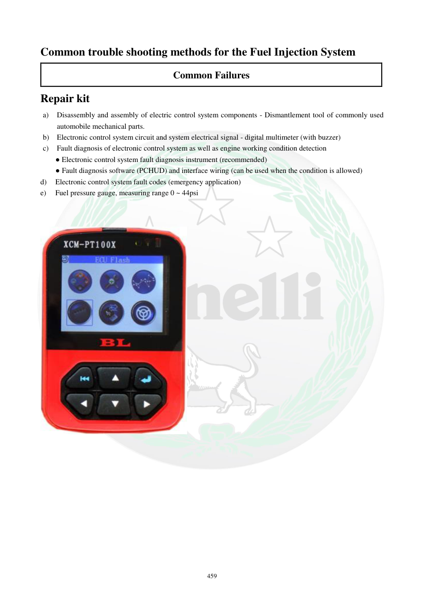

# Manual page 460

> Source: [page-0460.md](../source/page-0460.md)

## Page image / diagram

## Extracted text

# Source page 460

 
459 
Common trouble shooting methods for the Fuel Injection System 
Common Failures 
Repair kit 
a) 
Disassembly and assembly of electric control system components - Dismantlement tool of commonly used 
automobile mechanical parts. 
b) Electronic control system circuit and system electrical signal - digital multimeter (with buzzer) 
c) 
Fault diagnosis of electronic control system as well as engine working condition detection 
● Electronic control system fault diagnosis instrument (recommended) 
● Fault diagnosis software (PCHUD) and interface wiring (can be used when the condition is allowed) 
d) 
Electronic control system fault codes (emergency application)  
e) 
Fuel pressure gauge, measuring range 0 ~ 44psi

## Persian notes

### ابزارهای پیشنهادی عیب‌یابی EFI
منبع برای تعمیر و تشخیص سیستم تزریق سوخت این ابزارها را معرفی می‌کند:
- ابزار باز و بست قطعات سیستم کنترل الکترونیکی و ابزارهای مکانیکی عمومی خودرو
- مولتی‌متر دیجیتال، ترجیحاً دارای بیزر
- دستگاه تخصصی تشخیص سیستم کنترل الکترونیکی و وضعیت موتور
- نرم‌افزار **PCHUD** به همراه سیم رابط، در صورت امکان
- جدول/کدهای خطای سیستم برای کاربرد اضطراری
- گیج فشار سوخت با محدوده **0 تا 44 psi**

برای اندازه‌گیری و تشخیص، مقدار ابزار باید متناسب با محدوده تست باشد؛ مخصوصاً در مدارهای الکترونیکی نباید سیگنال یا ولتاژ خارج از محدوده مجاز اعمال شود.
