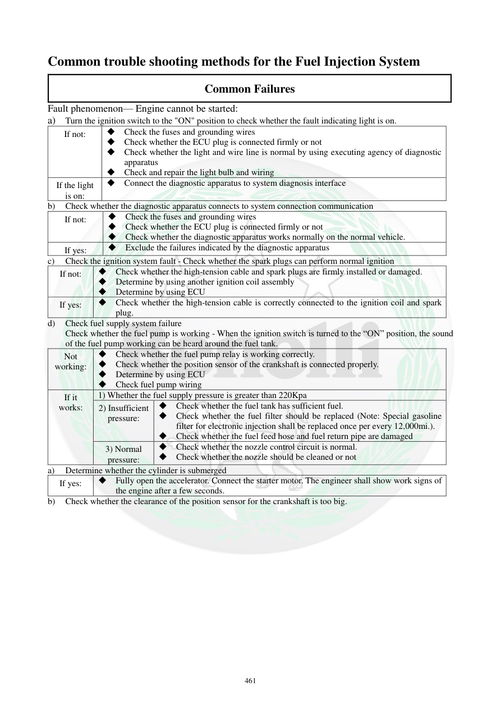

# Manual page 462

> Source: [page-0462.md](../source/page-0462.md)

## Page image / diagram

## Extracted text

# Source page 462

 
461 
Common trouble shooting methods for the Fuel Injection System 
Common Failures 
Fault phenomenon— Engine cannot be started: 
a) 
Turn the ignition switch to the "ON" position to check whether the fault indicating light is on.  
If not: 
 Check the fuses and grounding wires 
 Check whether the ECU plug is connected firmly or not 
 Check whether the light and wire line is normal by using executing agency of diagnostic 
apparatus 
 Check and repair the light bulb and wiring 
If the light 
is on: 
 Connect the diagnostic apparatus to system diagnosis interface 
b) 
Check whether the diagnostic apparatus connects to system connection communication 
If not: 
 Check the fuses and grounding wires 
 Check whether the ECU plug is connected firmly or not 
 Check whether the diagnostic apparatus works normally on the normal vehicle.  
If yes: 
 Exclude the failures indicated by the diagnostic apparatus 
c)  Check the ignition system fault - Check whether the spark plugs can perform normal ignition 
If not: 
 Check whether the high-tension cable and spark plugs are firmly installed or damaged.  
 Determine by using another ignition coil assembly 
 Determine by using ECU 
If yes: 
 Check whether the high-tension cable is correctly connected to the ignition coil and spark 
plug.  
d) 
Check fuel supply system failure 
Check whether the fuel pump is working - When the ignition switch is turned to the “ON” position, the sound 
of the fuel pump working can be heard around the fuel tank.  
Not 
working: 
 Check whether the fuel pump relay is working correctly.  
 Check whether the position sensor of the crankshaft is connected properly.  
 Determine by using ECU 
 Check fuel pump wiring  
If it 
works: 
1) Whether the fuel supply pressure is greater than 220Kpa  
2) Insufficient 
pressure: 
 Check whether the fuel tank has sufficient fuel.  
 Check whether the fuel filter should be replaced (Note: Special gasoline 
filter for electronic injection shall be replaced once per every 12,000mi.).  
 Check whether the fuel feed hose and fuel return pipe are damaged 
3) Normal 
pressure: 
 Check whether the nozzle control circuit is normal.  
 Check whether the nozzle should be cleaned or not 
a) 
Determine whether the cylinder is submerged  
If yes: 
 Fully open the accelerator. Connect the starter motor. The engineer shall show work signs of 
the engine after a few seconds.  
b) 
Check whether the clearance of the position sensor for the crankshaft is too big.

## Persian notes

<!-- Persian translation/explanation will be added here. -->
