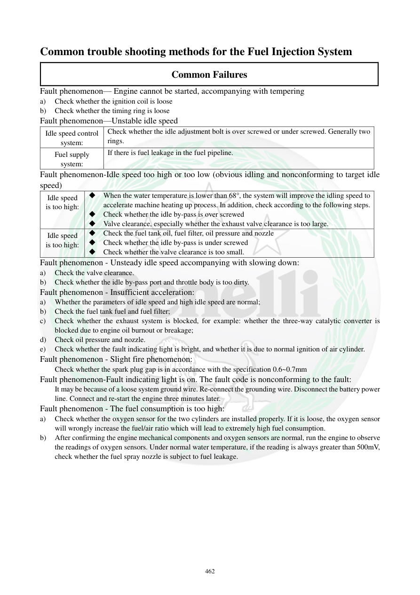

# Manual page 463

> Source: [page-0463.md](../source/page-0463.md)

## Page image / diagram

## Extracted text

# Source page 463

 
462 
Common trouble shooting methods for the Fuel Injection System 
Common Failures 
Fault phenomenon— Engine cannot be started, accompanying with tempering 
a) 
Check whether the ignition coil is loose 
b) 
Check whether the timing ring is loose 
Fault phenomenon—Unstable idle speed 
Idle speed control 
system: 
Check whether the idle adjustment bolt is over screwed or under screwed. Generally two 
rings.  
Fuel supply 
system: 
If there is fuel leakage in the fuel pipeline.   
Fault phenomenon-Idle speed too high or too low (obvious idling and nonconforming to target idle 
speed)  
Idle speed 
is too high: 
 When the water temperature is lower than 68°, the system will improve the idling speed to 
accelerate machine heating up process. In addition, check according to the following steps. 
 Check whether the idle by-pass is over screwed  
 Valve clearance, especially whether the exhaust valve clearance is too large.  
Idle speed 
is too high: 
 Check the fuel tank oil, fuel filter, oil pressure and nozzle 
 Check whether the idle by-pass is under screwed 
 Check whether the valve clearance is too small.  
Fault phenomenon - Unsteady idle speed accompanying with slowing down:  
a) 
Check the valve clearance. 
b) 
Check whether the idle by-pass port and throttle body is too dirty. 
Fault phenomenon - Insufficient acceleration: 
a) 
Whether the parameters of idle speed and high idle speed are normal; 
b) 
Check the fuel tank fuel and fuel filter; 
c) 
Check whether the exhaust system is blocked, for example: whether the three-way catalytic converter is 
blocked due to engine oil burnout or breakage; 
d) 
Check oil pressure and nozzle.  
e) 
Check whether the fault indicating light is bright, and whether it is due to normal ignition of air cylinder.  
Fault phenomenon - Slight fire phenomenon: 
Check whether the spark plug gap is in accordance with the specification 0.6~0.7mm 
Fault phenomenon-Fault indicating light is on. The fault code is nonconforming to the fault: 
It may be because of a loose system ground wire. Re-connect the grounding wire. Disconnect the battery power 
line. Connect and re-start the engine three minutes later.  
Fault phenomenon - The fuel consumption is too high:  
a) 
Check whether the oxygen sensor for the two cylinders are installed properly. If it is loose, the oxygen sensor 
will wrongly increase the fuel/air ratio which will lead to extremely high fuel consumption.  
b) 
After confirming the engine mechanical components and oxygen sensors are normal, run the engine to observe 
the readings of oxygen sensors. Under normal water temperature, if the reading is always greater than 500mV, 
check whether the fuel spray nozzle is subject to fuel leakage.

## Persian notes

### عیب‌یابی مشکلات متداول EFI
**روشن نشدن همراه با پس‌زدن/Backfire**
- شل بودن کویل
- شل بودن رینگ/حلقه زمان‌بندی

**دور آرام ناپایدار**
- تنظیم بیش از حد یا کمتر از حد پیچ تنظیم دور آرام
- نشتی سوخت در مسیر سوخت‌رسانی

**دور آرام بیش از حد بالا**
- در دمای آب پایین، افزایش دور برای گرم شدن موتور می‌تواند طبیعی باشد.
- بررسی پیچ بای‌پس دور آرام
- بررسی لقی سوپاپ، مخصوصاً بیش از حد بودن لقی اگزوز

**دور آرام پایین**
- سوخت، فیلتر، فشار سوخت و انژکتور
- تنظیم پیچ بای‌پس
- کم بودن لقی سوپاپ

**دور آرام ناپایدار همراه با افت دور**
- لقی سوپاپ
- کثیفی دریچه گاز و مسیر بای‌پس

**شتاب ضعیف**
- پارامترهای دور آرام و دور بالا
- سوخت و فیلتر
- گرفتگی اگزوز/کاتالیست
- فشار سوخت و انژکتور
- چراغ خطا و وضعیت احتراق

**مصرف سوخت زیاد**
- نصب صحیح سنسورهای O2 هر دو سیلندر
- اگر پس از گرم شدن موتور ولتاژ O2 دائماً بیش از **500mV** باشد، نشتی انژکتور بررسی شود.

**کد خطای نامتناسب با ایراد واقعی:** اتصال بدنه سیستم را بررسی و پس از قطع باتری، طبق منبع حدود 3 دقیقه بعد دوباره سیستم را راه‌اندازی کنید.
