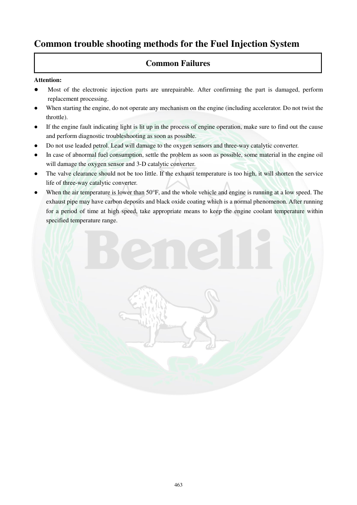

# Manual page 464

> Source: [page-0464.md](../source/page-0464.md)

## Page image / diagram

## Extracted text

# Source page 464

 
463 
Common trouble shooting methods for the Fuel Injection System 
Common Failures 
Attention: 
● 
Most of the electronic injection parts are unrepairable. After confirming the part is damaged, perform 
replacement processing.  
● 
When starting the engine, do not operate any mechanism on the engine (including accelerator. Do not twist the 
throttle).  
● 
If the engine fault indicating light is lit up in the process of engine operation, make sure to find out the cause 
and perform diagnostic troubleshooting as soon as possible.  
● 
Do not use leaded petrol. Lead will damage to the oxygen sensors and three-way catalytic converter.  
● 
In case of abnormal fuel consumption, settle the problem as soon as possible, some material in the engine oil 
will damage the oxygen sensor and 3-D catalytic converter.  
● 
The valve clearance should not be too little. If the exhaust temperature is too high, it will shorten the service 
life of three-way catalytic converter.  
●  When the air temperature is lower than 50F, and the whole vehicle and engine is running at a low speed. The 
exhaust pipe may have carbon deposits and black oxide coating which is a normal phenomenon. After running 
for a period of time at high speed, take appropriate means to keep the engine coolant temperature within 
specified temperature range.

## Persian notes

### هشدارهای مهم سیستم EFI
- بسیاری از قطعات تزریق الکترونیکی قابل تعمیر نیستند و پس از تأیید خرابی باید تعویض شوند.
- هنگام استارت، طبق منبع نباید مکانیزم‌های موتور از جمله گاز دادن/چرخاندن دریچه گاز را دستکاری کرد.
- روشن ماندن چراغ خطا هنگام کار موتور باید در اسرع وقت عیب‌یابی شود.
- بنزین سرب‌دار استفاده نشود؛ سرب می‌تواند به سنسورهای O2 و کاتالیست سه‌راهه آسیب بزند.
- مصرف سوخت غیرعادی باید بررسی شود، زیرا شرایط نامناسب موتور و ورود برخی مواد به روغن می‌تواند به O2 و کاتالیست آسیب بزند.
- لقی سوپاپ نباید بیش از حد کم باشد، چون افزایش دمای اگزوز می‌تواند عمر کاتالیست را کاهش دهد.
- در هوای زیر **50°F حدود 10°C** و کارکرد طولانی با سرعت پایین، ایجاد دوده و لایه اکسیدی سیاه روی اگزوز می‌تواند طبق منبع طبیعی باشد؛ پس از کارکرد مناسب در دور/سرعت بالاتر، دمای مایع خنک‌کننده باید در محدوده مشخص باقی بماند.
