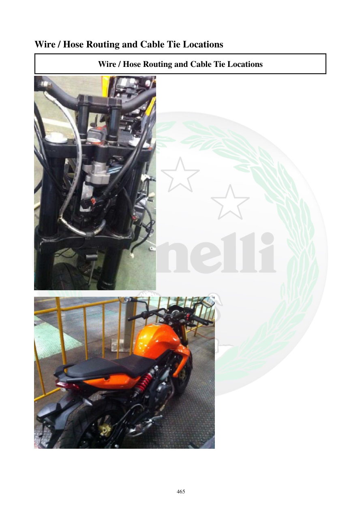

# Manual page 466

> Source: [page-0466.md](../source/page-0466.md)

## Page image / diagram

- [page-0466-img-02.jpeg](../images/embedded/page-0466-img-02.jpeg)

- [page-0466-img-03.jpeg](../images/embedded/page-0466-img-03.jpeg)

## Extracted text

# Source page 466

 
465 
Wire / Hose Routing and Cable Tie Locations 
Wire / Hose Routing and Cable Tie Locations

## Persian notes

<!-- Persian translation/explanation will be added here. -->
