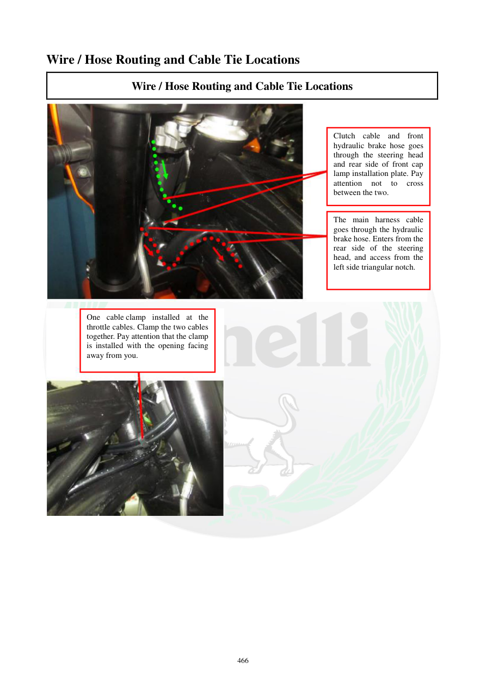

# Manual page 467

> Source: [page-0467.md](../source/page-0467.md)

## Page image / diagram

- [page-0467-img-02.jpeg](../images/embedded/page-0467-img-02.jpeg)

- [page-0467-img-03.jpeg](../images/embedded/page-0467-img-03.jpeg)

## Extracted text

# Source page 467

 
466 
Wire / Hose Routing and Cable Tie Locations 
Wire / Hose Routing and Cable Tie Locations 
 
 
 
 
Clutch cable and front 
hydraulic brake hose goes 
through the steering head 
and rear side of front cap 
lamp installation plate. Pay 
attention 
not 
to 
cross 
between the two. 
The main harness cable 
goes through the hydraulic 
brake hose. Enters from the 
rear side of the steering 
head, and access from the 
left side triangular notch. 
One cable clamp installed at the 
throttle cables. Clamp the two cables 
together. Pay attention that the clamp 
is installed with the opening facing 
away from you.

## Persian notes

<!-- Persian translation/explanation will be added here. -->
