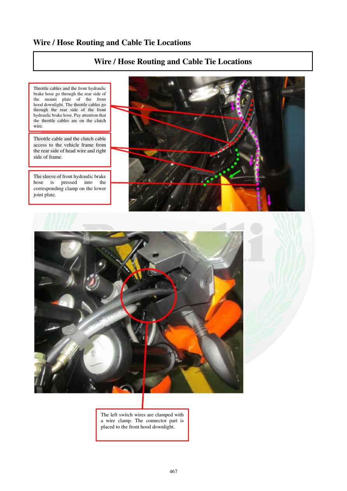

# Manual page 468

> Source: [page-0468.md](../source/page-0468.md)

## Page image / diagram

- [page-0468-img-02.jpeg](../images/embedded/page-0468-img-02.jpeg)

- [page-0468-img-03.jpeg](../images/embedded/page-0468-img-03.jpeg)

## Extracted text

# Source page 468

 
467 
Wire / Hose Routing and Cable Tie Locations 
Wire / Hose Routing and Cable Tie Locations 
 
 
 
 
 
Throttle cables and the front hydraulic 
brake hose go through the rear side of 
the 
mount 
plate 
of 
the 
front 
hood downlight. The throttle cables go 
through the rear side of the front 
hydraulic brake hose. Pay attention that 
the throttle cables are on the clutch 
wire. 
Throttle cable and the clutch cable 
access to the vehicle frame from 
the rear side of head wire and right 
side of frame. 
The sleeve of front hydraulic brake 
hose 
is 
pressed 
into 
the 
corresponding clamp on the lower 
joint plate. 
The left switch wires are clamped with 
a wire clamp. The connector part is 
placed to the front hood downlight.

## Persian notes

<!-- Persian translation/explanation will be added here. -->
