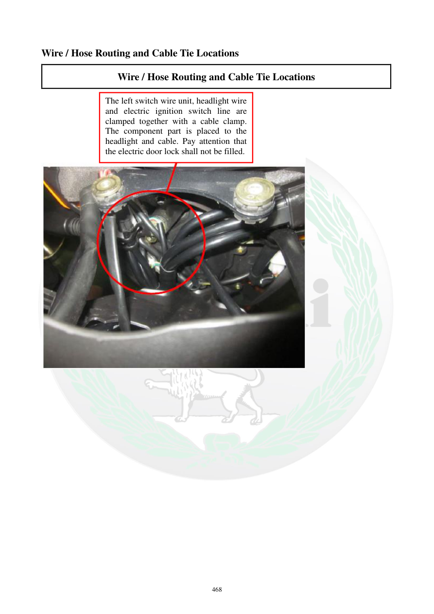

# Manual page 469

> Source: [page-0469.md](../source/page-0469.md)

## Page image / diagram

- [page-0469-img-02.jpeg](../images/embedded/page-0469-img-02.jpeg)

## Extracted text

# Source page 469

 
468 
Wire / Hose Routing and Cable Tie Locations 
Wire / Hose Routing and Cable Tie Locations 
 
 
 
 
 
The left switch wire unit, headlight wire 
and electric ignition switch line are 
clamped together with a cable clamp. 
The component part is placed to the 
headlight and cable. Pay attention that 
the electric door lock shall not be filled.

## Persian notes

<!-- Persian translation/explanation will be added here. -->
