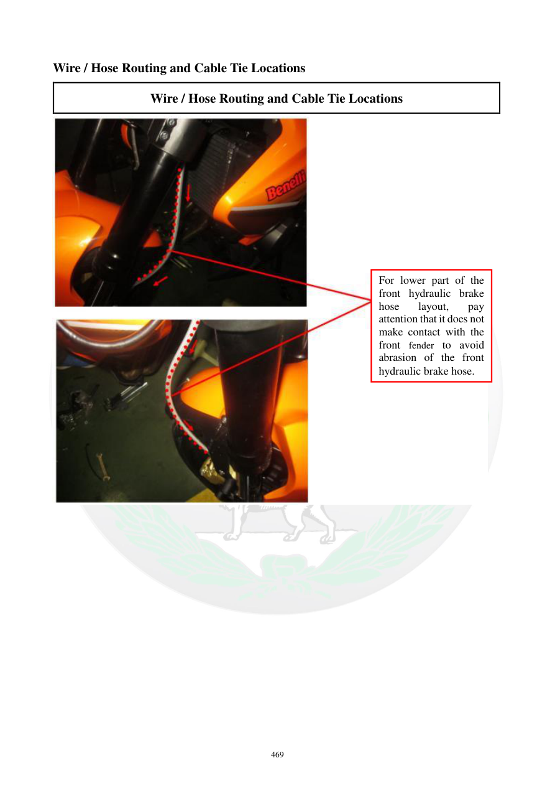

# Manual page 470

> Source: [page-0470.md](../source/page-0470.md)

## Page image / diagram

- [page-0470-img-01.jpeg](../images/embedded/page-0470-img-01.jpeg)

## Extracted text

# Source page 470

 
469 
Wire / Hose Routing and Cable Tie Locations 
Wire / Hose Routing and Cable Tie Locations 
 
 
 
 
For lower part of the 
front hydraulic brake 
hose 
layout, 
pay 
attention that it does not 
make contact with the 
front fender to avoid 
abrasion of the front 
hydraulic brake hose.

## Persian notes

<!-- Persian translation/explanation will be added here. -->
