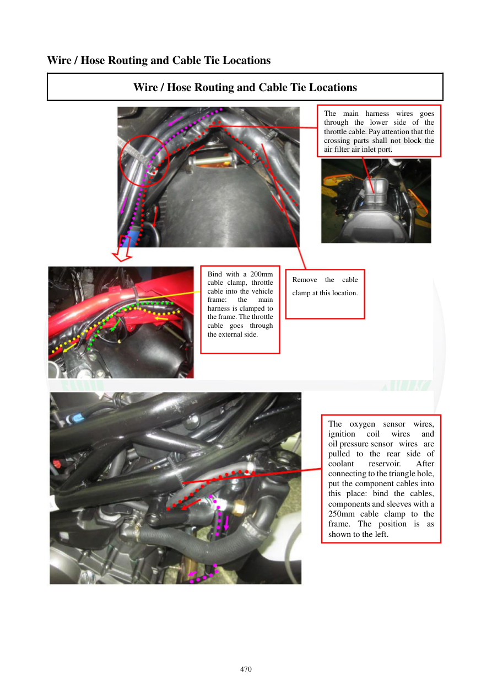

# Manual page 471

> Source: [page-0471.md](../source/page-0471.md)

## Page image / diagram

- [page-0471-img-02.jpeg](../images/embedded/page-0471-img-02.jpeg)

- [page-0471-img-03.jpeg](../images/embedded/page-0471-img-03.jpeg)

## Extracted text

# Source page 471

 
470 
Wire / Hose Routing and Cable Tie Locations 
Wire / Hose Routing and Cable Tie Locations 
 
 
 
 
 
 
The main harness wires goes 
through the lower side of the 
throttle cable. Pay attention that the 
crossing parts shall not block the 
air filter air inlet port. 
Bind with a 200mm 
cable clamp, throttle 
cable into the vehicle 
frame: 
the 
main 
harness is clamped to 
the frame. The throttle 
cable goes through 
the external side. 
Remove 
the 
cable 
clamp at this location. 
The oxygen sensor wires, 
ignition 
coil 
wires 
and 
oil pressure sensor wires are 
pulled to the rear side of 
coolant 
reservoir. 
After 
connecting to the triangle hole, 
put the component cables into 
this place: bind the cables, 
components and sleeves with a 
250mm cable clamp to the 
frame. The position is as 
shown to the left.

## Persian notes

<!-- Persian translation/explanation will be added here. -->
