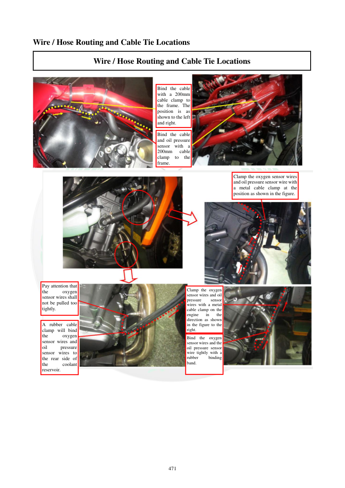

# Manual page 472

> Source: [page-0472.md](../source/page-0472.md)

## Page image / diagram

- [page-0472-img-02.jpeg](../images/embedded/page-0472-img-02.jpeg)

- [page-0472-img-03.jpeg](../images/embedded/page-0472-img-03.jpeg)

## Extracted text

# Source page 472

 
471 
Wire / Hose Routing and Cable Tie Locations 
Wire / Hose Routing and Cable Tie Locations 
 
 
 
 
Bind the cable 
with a 200mm 
cable clamp to 
the frame. The 
position is as 
shown to the left 
and right. 
Bind the cable 
and oil pressure 
sensor with a 
200mm 
cable 
clamp 
to 
the 
frame. 
Clamp the oxygen sensor wires 
and oil pressure sensor wire with 
a metal cable clamp at the 
position as shown in the figure. 
Pay attention that 
the 
oxygen 
sensor wires shall 
not be pulled too 
tightly. 
A rubber cable 
clamp will bind 
the 
oxygen 
sensor wires and 
oil 
pressure 
sensor wires to 
the rear side of 
the 
coolant 
reservoir. 
Clamp the oxygen 
sensor wires and oil 
pressure 
sensor 
wires with a metal 
cable clamp on the 
engine 
in 
the 
direction as shown 
in the figure to the 
right. 
Bind the oxygen 
sensor wires and the 
oil pressure sensor 
wire tightly with a 
rubber 
binding 
band.

## Persian notes

<!-- Persian translation/explanation will be added here. -->
