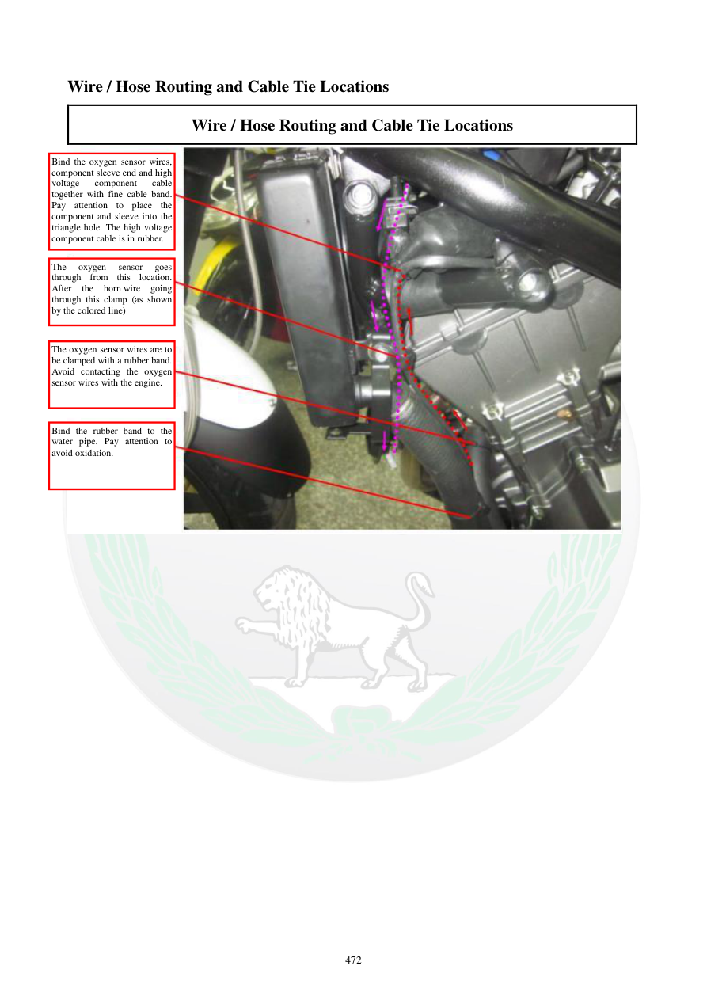

# Manual page 473

> Source: [page-0473.md](../source/page-0473.md)

## Page image / diagram

- [page-0473-img-01.jpeg](../images/embedded/page-0473-img-01.jpeg)

## Extracted text

# Source page 473

 
472 
Wire / Hose Routing and Cable Tie Locations 
Wire / Hose Routing and Cable Tie Locations 
 
 
 
Bind the oxygen sensor wires, 
component sleeve end and high 
voltage 
component 
cable 
together with fine cable band. 
Pay attention to place the 
component and sleeve into the 
triangle hole. The high voltage 
component cable is in rubber. 
The 
oxygen 
sensor 
goes 
through from this location. 
After 
the 
horn wire 
going 
through this clamp (as shown 
by the colored line) 
The oxygen sensor wires are to 
be clamped with a rubber band. 
Avoid contacting the oxygen 
sensor wires with the engine. 
Bind the rubber band to the 
water pipe. Pay attention to 
avoid oxidation.

## Persian notes

<!-- Persian translation/explanation will be added here. -->
