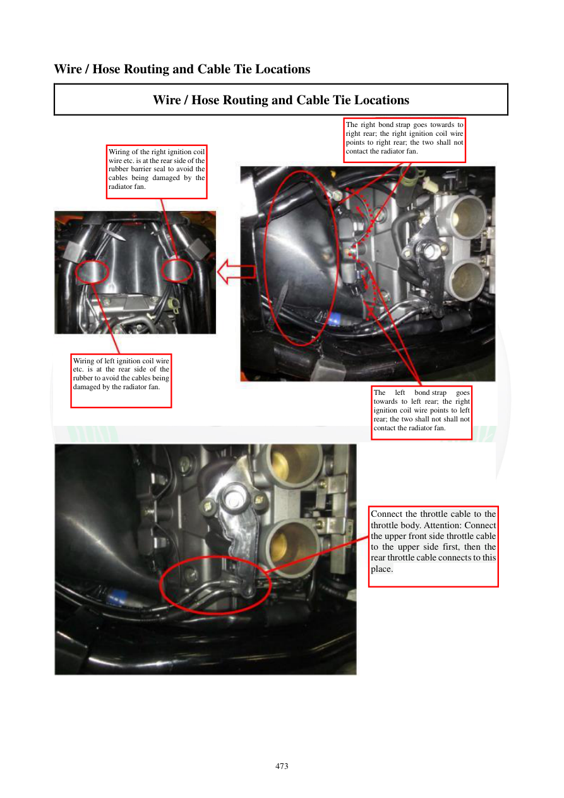

# Manual page 474

> Source: [page-0474.md](../source/page-0474.md)

## Page image / diagram

- [page-0474-img-01.jpeg](../images/embedded/page-0474-img-01.jpeg)

- [page-0474-img-02.jpeg](../images/embedded/page-0474-img-02.jpeg)

## Extracted text

# Source page 474

 
473 
Wire / Hose Routing and Cable Tie Locations 
Wire / Hose Routing and Cable Tie Locations 
 
 
 
 
 
 
Wiring of the right ignition coil 
wire etc. is at the rear side of the 
rubber barrier seal to avoid the 
cables being damaged by the 
radiator fan. 
The right bond strap goes towards to 
right rear; the right ignition coil wire 
points to right rear; the two shall not 
contact the radiator fan. 
Wiring of left ignition coil wire 
etc. is at the rear side of the 
rubber to avoid the cables being 
damaged by the radiator fan. 
 
The 
left 
bond strap 
goes 
towards to left rear; the right 
ignition coil wire points to left 
rear; the two shall not shall not 
contact the radiator fan. 
Connect the throttle cable to the 
throttle body. Attention: Connect 
the upper front side throttle cable 
to the upper side first, then the 
rear throttle cable connects to this 
place.

## Persian notes

<!-- Persian translation/explanation will be added here. -->
