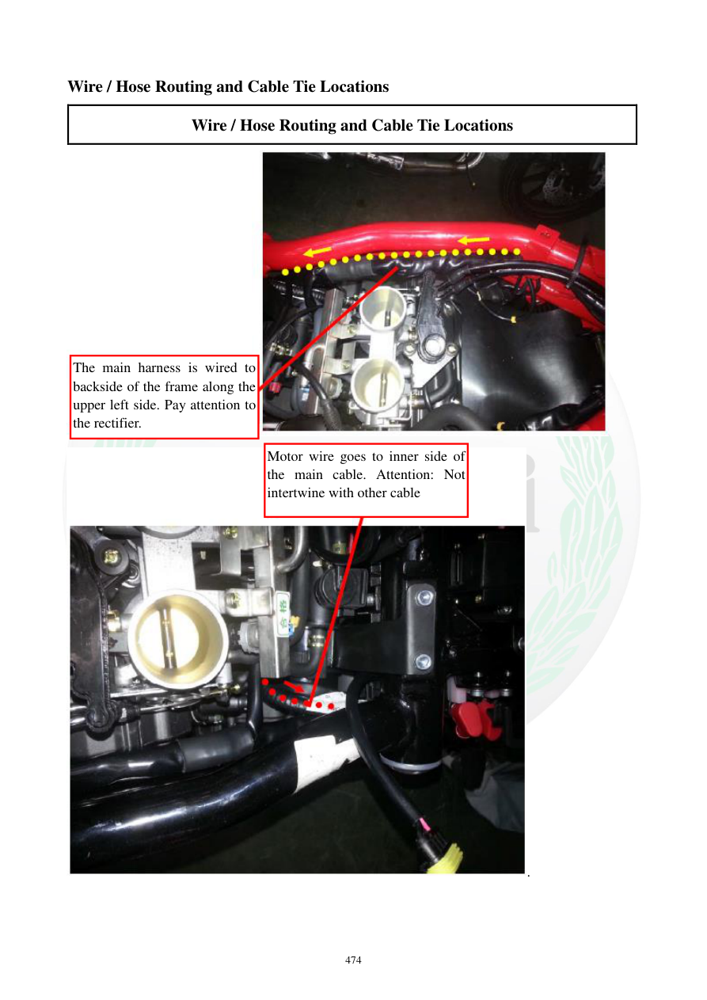

# Manual page 475

> Source: [page-0475.md](../source/page-0475.md)

## Page image / diagram

- [page-0475-img-01.jpeg](../images/embedded/page-0475-img-01.jpeg)

- [page-0475-img-02.jpeg](../images/embedded/page-0475-img-02.jpeg)

## Extracted text

# Source page 475

 
474 
Wire / Hose Routing and Cable Tie Locations 
Wire / Hose Routing and Cable Tie Locations 
 
. 
 
 
The main harness is wired to 
backside of the frame along the 
upper left side. Pay attention to 
the rectifier. 
Motor wire goes to inner side of 
the main cable. Attention: Not 
intertwine with other cable

## Persian notes

### مسیر دسته‌سیم اصلی و سیم موتور
- دسته‌سیم اصلی در قسمت عقب فریم و در امتداد بخش بالایی سمت چپ هدایت می‌شود.
- هنگام مسیربندی باید موقعیت رگولاتور/رکتیفایر در نظر گرفته شود.
- سیم موتور از سمت داخلی دسته‌سیم اصلی عبور می‌کند.
- سیم موتور نباید با سایر کابل‌ها درگیر یا درهم‌پیچیده شود.

هدف، ایجاد مسیر مرتب و جلوگیری از تماس سیم‌ها با قطعات متحرک، داغ یا لبه‌های فریم است.
