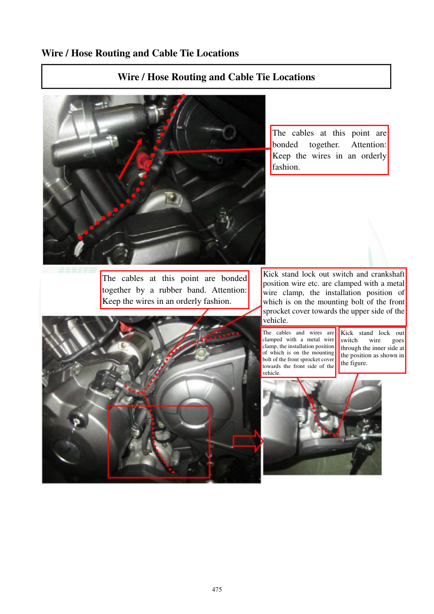

# Manual page 476

> Source: [page-0476.md](../source/page-0476.md)

## Page image / diagram

- [page-0476-img-01.jpeg](../images/embedded/page-0476-img-01.jpeg)

- [page-0476-img-02.jpeg](../images/embedded/page-0476-img-02.jpeg)

## Extracted text

# Source page 476

 
475 
Wire / Hose Routing and Cable Tie Locations 
Wire / Hose Routing and Cable Tie Locations 
 
 
 
 
 
 
 
 
 
The cables at this point are 
bonded 
together. 
Attention: 
Keep the wires in an orderly 
fashion.  
The cables at this point are bonded 
together by a rubber band. Attention: 
Keep the wires in an orderly fashion. 
Kick stand lock out switch and crankshaft 
position wire etc. are clamped with a metal 
wire clamp, the installation position of 
which is on the mounting bolt of the front 
sprocket cover towards the upper side of the 
vehicle. 
The cables and wires are 
clamped with a metal wire 
clamp, the installation position 
of which is on the mounting 
bolt of the front sprocket cover 
towards the front side of the 
vehicle. 
Kick stand lock out 
switch 
wire 
goes 
through the inner side at 
the position as shown in 
the figure.

## Persian notes

### بست‌بندی دسته‌سیم و سیم کلید جک جانبی
- کابل‌ها در نقاط مشخص‌شده با بست به‌صورت مرتب کنار هم نگه داشته می‌شوند.
- در بعضی نقاط از بست لاستیکی استفاده شده است.
- سیم کلید قطع‌کن جک جانبی و سیم سنسور موقعیت میل‌لنگ با بست فلزی مهار می‌شوند.
- محل بست فلزی روی پیچ نصب قاب چرخ‌زنجیر جلو و در جهت بالای موتورسیکلت است.
- گروه دیگری از سیم‌ها روی همان محدوده با بست فلزی به سمت جلوی موتور مهار می‌شوند.
- سیم کلید جک جانبی از سمت داخلی در محل مشخص‌شده عبور می‌کند.

**هشدار:** مرتب بودن سیم‌ها فقط زیبایی نیست. مسیر اشتباه می‌تواند باعث کشیدگی، ساییدگی یا گیرکردن سیم در قطعات متحرک شود.
