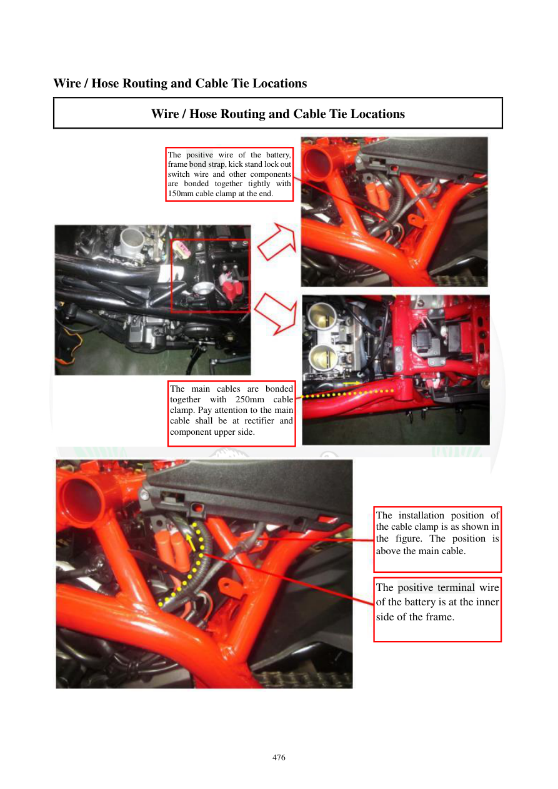

# Manual page 477

> Source: [page-0477.md](../source/page-0477.md)

## Page image / diagram

- [page-0477-img-01.jpeg](../images/embedded/page-0477-img-01.jpeg)

- [page-0477-img-02.jpeg](../images/embedded/page-0477-img-02.jpeg)

## Extracted text

# Source page 477

 
476 
 
Wire / Hose Routing and Cable Tie Locations 
Wire / Hose Routing and Cable Tie Locations 
 
 
 
 
The positive wire of the battery, 
frame bond strap, kick stand lock out 
switch wire and other components 
are bonded together tightly with 
150mm cable clamp at the end. 
The main cables are bonded 
together with 250mm cable 
clamp. Pay attention to the main 
cable shall be at rectifier and 
component upper side. 
The installation position of 
the cable clamp is as shown in 
the figure. The position is 
above the main cable. 
The positive terminal wire 
of the battery is at the inner 
side of the frame.

## Persian notes

### مسیر سیم مثبت باتری و دسته‌سیم اصلی
- سیم مثبت باتری، اتصال بدنه فریم، سیم کلید قطع‌کن جک جانبی و سایر سیم‌ها در انتهای مسیر با بست **150 mm** محکم می‌شوند.
- دسته‌سیم‌های اصلی با بست **250 mm** به هم مهار می‌شوند.
- دسته‌سیم اصلی باید نسبت به رگولاتور و قطعات اطراف، در موقعیت بالایی که تصویر نشان می‌دهد قرار گیرد.
- محل نصب بست باید مطابق تصویر و در بالای دسته‌سیم باشد.
- سیم مثبت باتری در سمت داخلی فریم قرار می‌گیرد.

برای بازسازی دسته‌سیم بعد از باز کردن باتری، فریم یا رگولاتور، این صفحه یکی از مراجع اصلی مسیر سیم‌هاست.
