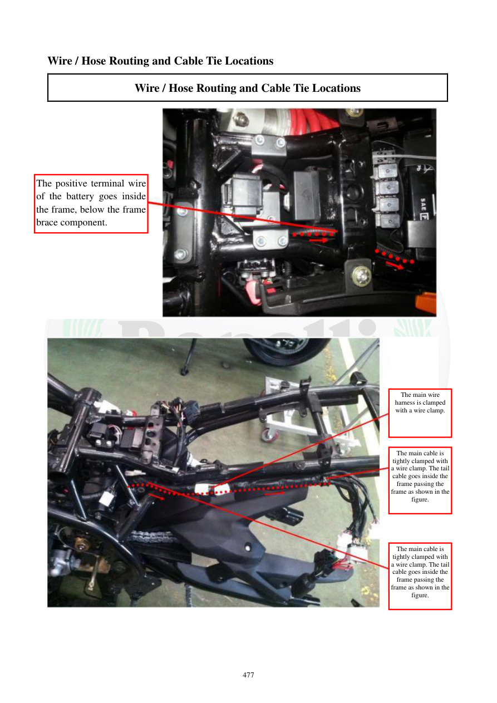

# Manual page 478

> Source: [page-0478.md](../source/page-0478.md)

## Page image / diagram

- [page-0478-img-01.jpeg](../images/embedded/page-0478-img-01.jpeg)

- [page-0478-img-02.jpeg](../images/embedded/page-0478-img-02.jpeg)

## Extracted text

# Source page 478

 
477 
Wire / Hose Routing and Cable Tie Locations 
Wire / Hose Routing and Cable Tie Locations 
 
 
 
 
 
 
The positive terminal wire 
of the battery goes inside 
the frame, below the frame 
brace component. 
The main wire 
harness is clamped 
with a wire clamp. 
The main cable is 
tightly clamped with 
a wire clamp. The tail 
cable goes inside the 
frame passing the 
frame as shown in the 
figure. 
The main cable is 
tightly clamped with 
a wire clamp. The tail 
cable goes inside the 
frame passing the 
frame as shown in the 
figure.

## Persian notes

<!-- Persian translation/explanation will be added here. -->
