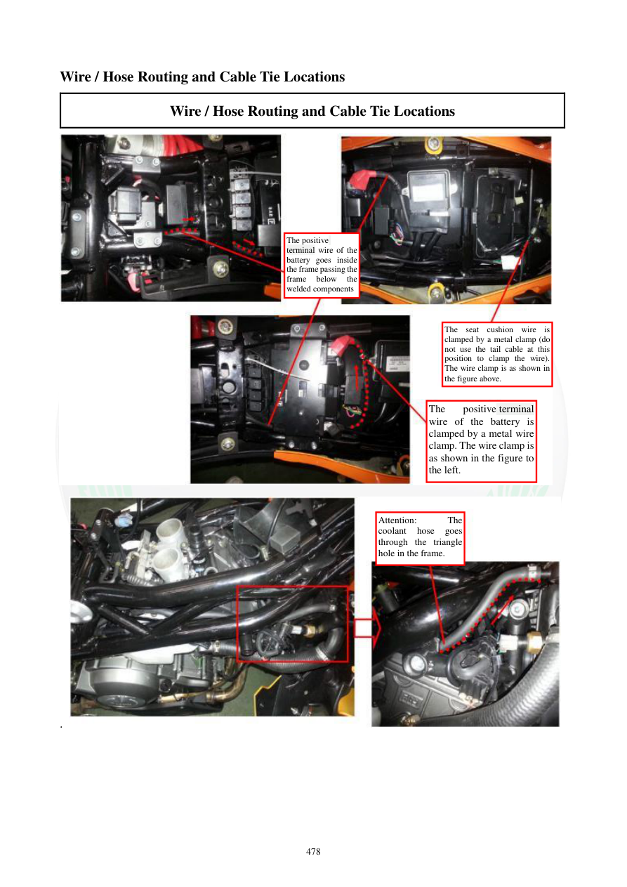

# Manual page 479

> Source: [page-0479.md](../source/page-0479.md)

## Page image / diagram

- [page-0479-img-01.jpeg](../images/embedded/page-0479-img-01.jpeg)

- [page-0479-img-02.jpeg](../images/embedded/page-0479-img-02.jpeg)

## Extracted text

# Source page 479

 
478 
Wire / Hose Routing and Cable Tie Locations 
Wire / Hose Routing and Cable Tie Locations 
 
. 
 
 
 
 
 
The positive  
terminal wire of the 
battery goes inside 
the frame passing the 
frame 
below 
the 
welded components 
The seat cushion wire is 
clamped by a metal clamp (do 
not use the tail cable at this 
position to clamp the wire). 
The wire clamp is as shown in 
the figure above.   
The 
positive terminal 
wire of the battery is 
clamped by a metal wire 
clamp. The wire clamp is 
as shown in the figure to 
the left. 
Attention: 
The 
coolant 
hose 
goes 
through the triangle 
hole in the frame.

## Persian notes

### سیم مثبت باتری و شیلنگ مایع خنک‌کننده
- سیم مثبت باتری از داخل فریم و زیر قطعات جوش‌شده عبور می‌کند.
- سیم مربوط به بالشتک/صندلی با بست فلزی مهار می‌شود و نباید از کابل انتهایی به‌عنوان محل مهار آن استفاده شود.
- سیم مثبت باتری نیز در محل مشخص‌شده با بست فلزی مهار می‌شود.
- شیلنگ مایع خنک‌کننده باید از سوراخ مثلثی فریم عبور کند.

در مونتاژ مجدد، مسیر سیم مثبت و شیلنگ باید بدون له‌شدگی، کشش یا تماس با لبه‌های تیز فریم باشد.
