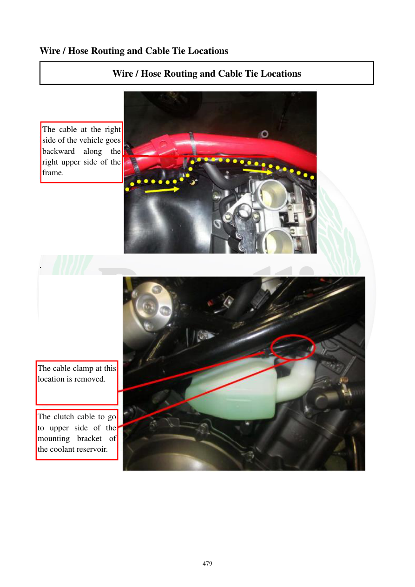

# Manual page 480

> Source: [page-0480.md](../source/page-0480.md)

## Page image / diagram

- [page-0480-img-01.jpeg](../images/embedded/page-0480-img-01.jpeg)

- [page-0480-img-02.jpeg](../images/embedded/page-0480-img-02.jpeg)

## Extracted text

# Source page 480

 
479 
Wire / Hose Routing and Cable Tie Locations 
Wire / Hose Routing and Cable Tie Locations 
 
. 
 
 
 
 
The cable at the right 
side of the vehicle goes 
backward along the 
right upper side of the 
frame. 
The cable clamp at this 
location is removed. 
The clutch cable to go 
to upper side of the 
mounting bracket of 
the coolant reservoir.

## Persian notes

### مسیر کابل سمت راست و کابل کلاچ
- کابل سمت راست موتورسیکلت در امتداد قسمت بالایی سمت راست فریم به سمت عقب هدایت می‌شود.
- بست مشخص‌شده در این محل باید باز شود.
- کابل کلاچ باید از قسمت بالایی براکت نصب مخزن مایع خنک‌کننده عبور کند.

**تصویر صفحه** برای تعیین محل دقیق بست و مسیر کابل مرجع نهایی است.
