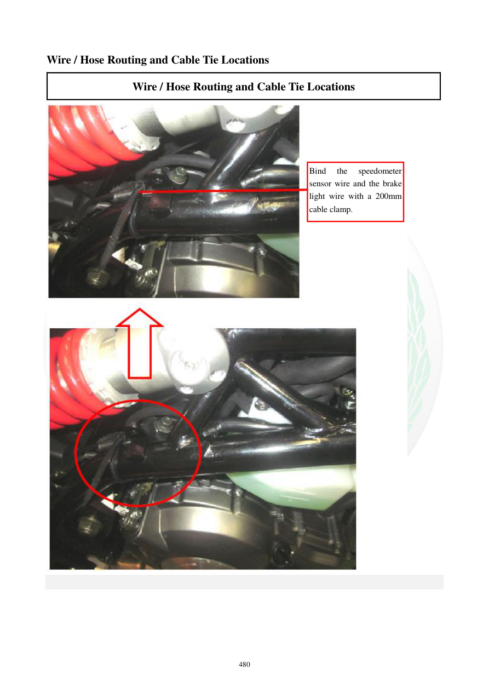

# Manual page 481

> Source: [page-0481.md](../source/page-0481.md)

## Page image / diagram

- [page-0481-img-01.jpeg](../images/embedded/page-0481-img-01.jpeg)

## Extracted text

# Source page 481

 
480 
Wire / Hose Routing and Cable Tie Locations 
Wire / Hose Routing and Cable Tie Locations 
 
 
 
 
 
Bind 
the 
speedometer 
sensor wire and the brake 
light wire with a 200mm 
cable clamp.

## Persian notes

<!-- Persian translation/explanation will be added here. -->
