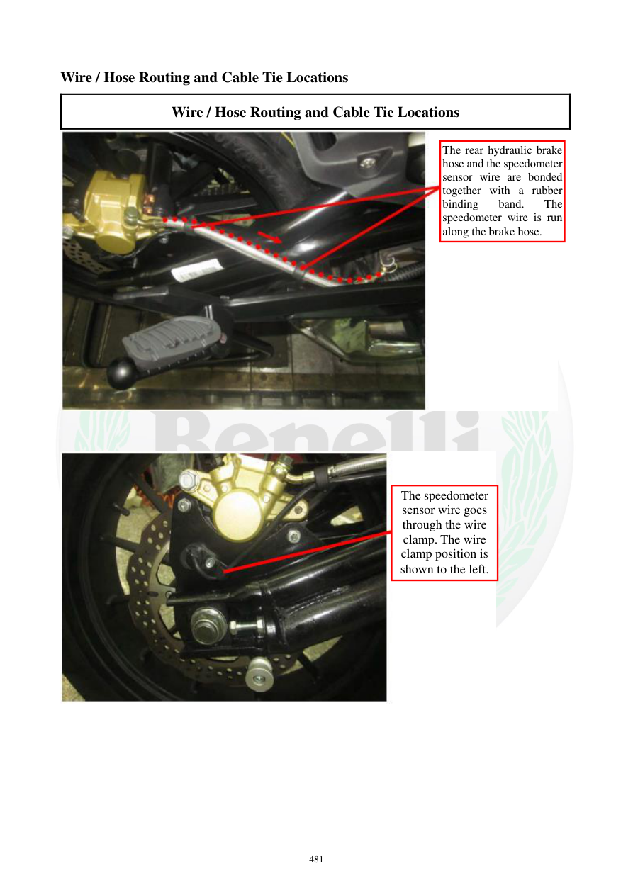

# Manual page 482

> Source: [page-0482.md](../source/page-0482.md)

## Page image / diagram

- [page-0482-img-01.jpeg](../images/embedded/page-0482-img-01.jpeg)

- [page-0482-img-02.jpeg](../images/embedded/page-0482-img-02.jpeg)

## Extracted text

# Source page 482

 
481 
Wire / Hose Routing and Cable Tie Locations 
Wire / Hose Routing and Cable Tie Locations 
 
 
 
 
 
 
 
The rear hydraulic brake 
hose and the speedometer 
sensor wire are bonded 
together with a rubber 
binding 
band. 
The 
speedometer wire is run 
along the brake hose. 
The speedometer 
sensor wire goes 
through the wire 
clamp. The wire 
clamp position is 
shown to the left.

## Persian notes

<!-- Persian translation/explanation will be added here. -->
