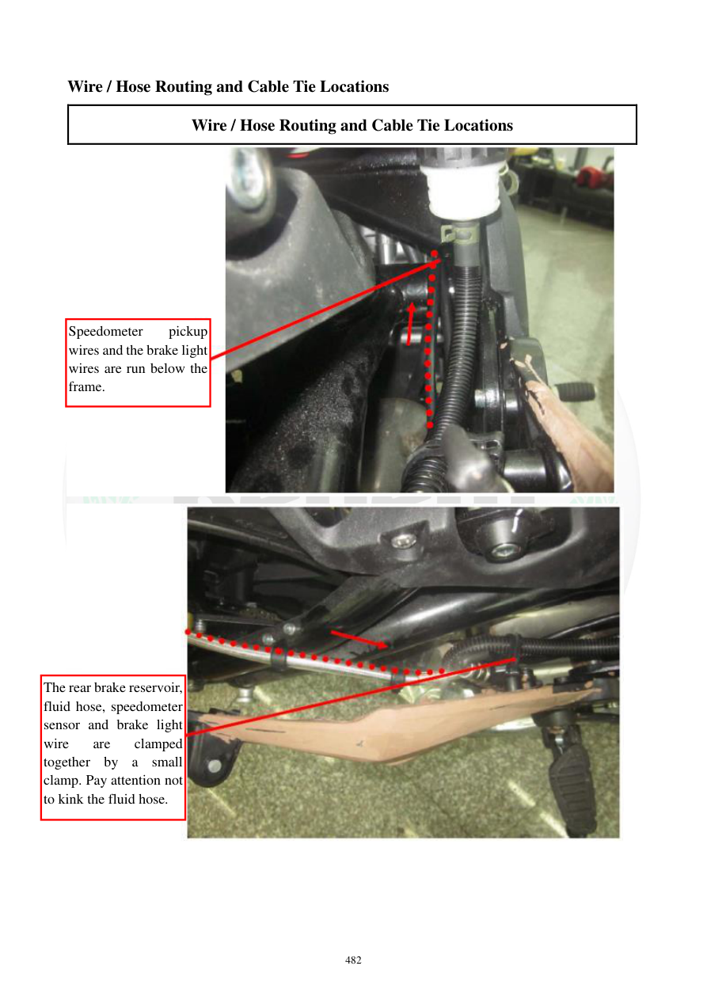

# Manual page 483

> Source: [page-0483.md](../source/page-0483.md)

## Page image / diagram

- [page-0483-img-01.jpeg](../images/embedded/page-0483-img-01.jpeg)

- [page-0483-img-02.jpeg](../images/embedded/page-0483-img-02.jpeg)

## Extracted text

# Source page 483

 
482 
Wire / Hose Routing and Cable Tie Locations 
Wire / Hose Routing and Cable Tie Locations 
 
 
 
 
Speedometer 
pickup 
wires and the brake light 
wires are run below the 
frame. 
The rear brake reservoir, 
fluid hose, speedometer 
sensor and brake light 
wire 
are 
clamped 
together by a small 
clamp. Pay attention not 
to kink the fluid hose.

## Persian notes

### مسیر سیم‌های ترمز عقب و سنسور سرعت
- سیم سنسور سرعت و سیم چراغ ترمز در قسمت زیر فریم عبور می‌کنند.
- مخزن روغن ترمز عقب، شیلنگ روغن، سیم سنسور سرعت و سیم چراغ ترمز در محل مشخص‌شده با بست کوچک کنار هم مهار می‌شوند.
- شیلنگ روغن ترمز نباید تا بخورد یا پیچیده شود.

پس از مونتاژ، مسیر شیلنگ ترمز را از نظر آزاد بودن جریان و نبودن خم تند بررسی کنید.
