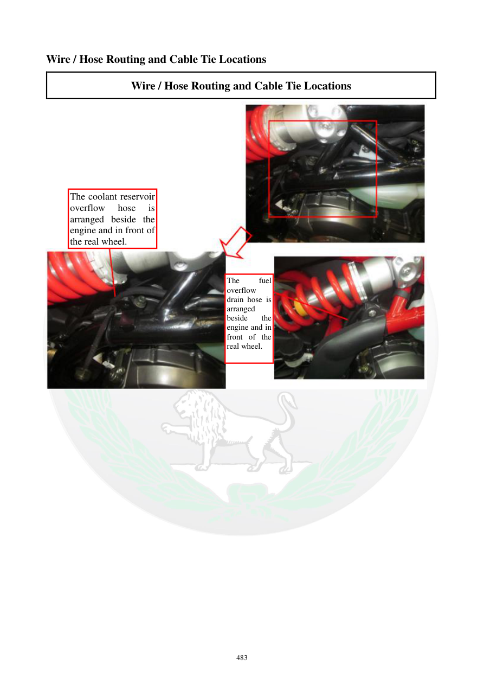

# Manual page 484

> Source: [page-0484.md](../source/page-0484.md)

## Page image / diagram

- [page-0484-img-01.jpeg](../images/embedded/page-0484-img-01.jpeg)

## Extracted text

# Source page 484

 
483 
Wire / Hose Routing and Cable Tie Locations 
Wire / Hose Routing and Cable Tie Locations 
 
 
 
 
 
 
 
The coolant reservoir 
overflow 
hose 
is 
arranged beside the 
engine and in front of 
the real wheel. 
The 
fuel 
overflow 
drain hose is 
arranged 
beside 
the 
engine and in 
front of the 
real wheel.

## Persian notes

<!-- Persian translation/explanation will be added here. -->
