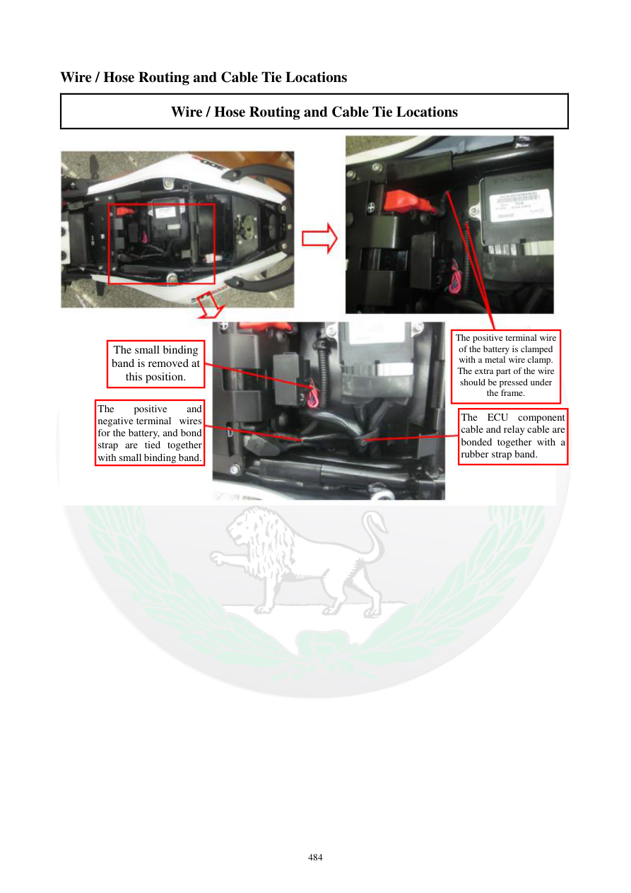

# Manual page 485

> Source: [page-0485.md](../source/page-0485.md)

## Page image / diagram

- [page-0485-img-01.jpeg](../images/embedded/page-0485-img-01.jpeg)

## Extracted text

# Source page 485

 
484 
Wire / Hose Routing and Cable Tie Locations 
Wire / Hose Routing and Cable Tie Locations 
 
 
 
 
 
 
 
 
 
 
The small binding 
band is removed at 
this position. 
The positive terminal wire 
of the battery is clamped 
with a metal wire clamp. 
The extra part of the wire 
should be pressed under 
the frame. 
The ECU component 
cable and relay cable are 
bonded together with a 
rubber strap band. 
The 
positive 
and 
negative terminal wires 
for the battery, and bond 
strap are tied together 
with small binding band.

## Persian notes

### بست‌بندی سیم‌های باتری و ECU
- بست کوچک در محل مشخص‌شده باز می‌شود.
- سیم مثبت باتری با بست فلزی مهار می‌شود.
- قسمت اضافی سیم باید زیر فریم قرار گیرد و بیرون‌زدگی نداشته باشد.
- کابل ECU و کابل رله با بند لاستیکی کنار هم قرار می‌گیرند.
- سیم‌های مثبت و منفی باتری و اتصال بدنه نیز با بست کوچک در محل مشخص‌شده مهار می‌شوند.

هدف این چیدمان جلوگیری از تماس سیم‌ها با قطعات متحرک و حفظ فاصله مناسب از منابع گرماست.
