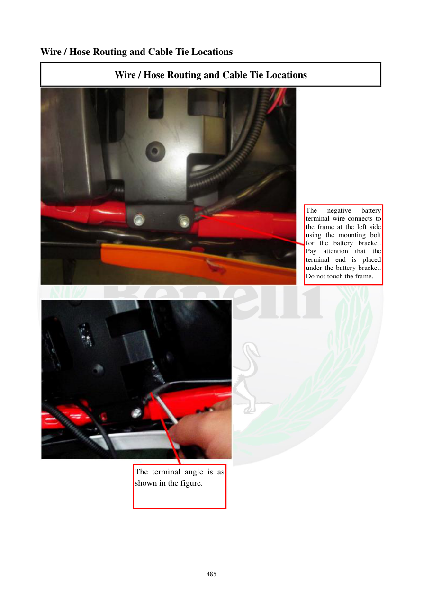

# Manual page 486

> Source: [page-0486.md](../source/page-0486.md)

## Page image / diagram

- [page-0486-img-01.jpeg](../images/embedded/page-0486-img-01.jpeg)

- [page-0486-img-02.jpeg](../images/embedded/page-0486-img-02.jpeg)

## Extracted text

# Source page 486

 
485 
Wire / Hose Routing and Cable Tie Locations 
Wire / Hose Routing and Cable Tie Locations 
 
 
 
 
The 
negative 
battery 
terminal wire connects to 
the frame at the left side 
using the mounting bolt 
for the battery bracket. 
Pay attention that the 
terminal end is placed 
under the battery bracket. 
Do not touch the frame.   
The terminal angle is as 
shown in the figure.

## Persian notes

<!-- Persian translation/explanation will be added here. -->
