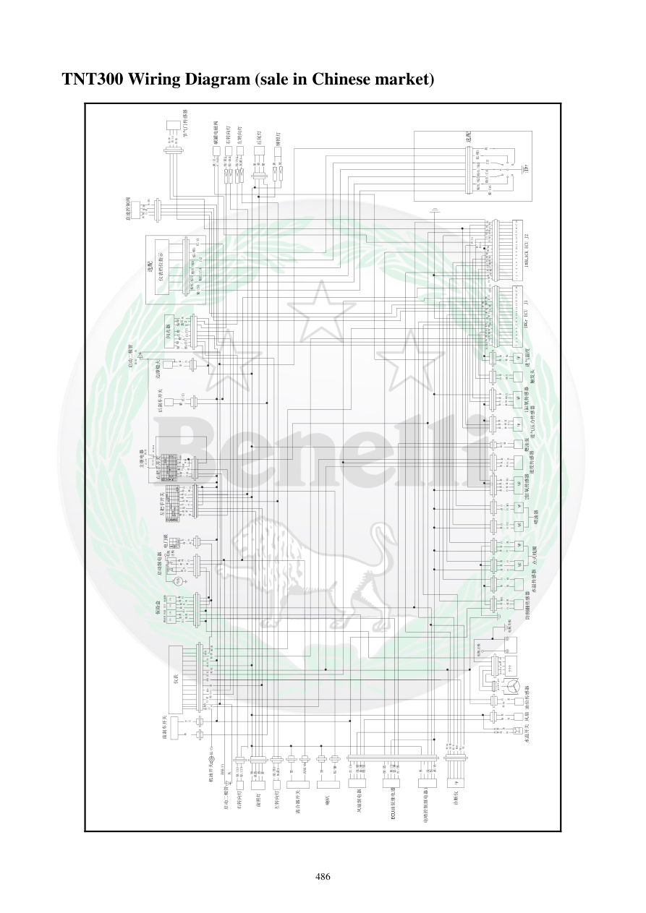

# Manual page 487

> Source: [page-0487.md](../source/page-0487.md)

## Page image / diagram

## Extracted text

# Source page 487

 
486 
TNT300 Wiring Diagram (sale in Chinese market) 
红1
黑
/
黄1A
浅绿A
启动二极管
灰
黄/红
电瓶
正极
马达
电瓶负极
电瓶正极
،ء،م،ء،م،ء،م
،ء،م،ء،م??
،ء،م红
/
白
棕/白
机油开关
棕
/
白
黄
/
灰
灰
黑/棕
绿1
绿1
水温开关
2缸氧传感器
黄
/
棕
黑
/
蓝
黄
/
蓝1
启动二极管
浅绿/白
灰
蓝/黄
黑/白1
灰/红
橙/黑
黄/蓝1
黄/棕
红/浅蓝1
碳罐电磁阀
绿
/
白1
绿
/
黑1
橙
/
白3
橙/黑
绿灰
棕/黑
红/白
黑
黑/棕
灰/红
蓝
橙3
橙/白3
红/蓝
黄/紫
黄/紫
白/黄
白/黄
紫/棕
紫/棕
灰/黄1
棕
棕
红/棕
蓝/黄
浅绿
白/棕
白/绿
蓝/
粉红1
黑/蓝
黑/紫
黄/绿
白/红
白/紫
蓝/白
绿/紫
绿/紫
黑
白/黑
粉红/黑
黑/红
黑
棕/红
棕/红
粉红
粉红
棕/黑
怠速控制阀
电喷控制继电器1
棕
绿
黑
紫
/
黄
粉
红
浅
绿
/
白
红
保险丝
40A
启动继电器
风扇
燃油泵
ECU
电源锁
红/黑
黑
黑
/
蓝
黑
/
紫
诊断仪
进气温度
油位传感器
黑
绿
/
棕
103℃
13
18
16 17
15
14
4
1
2
3
9
7
8
5
6
12
11
10
1#BLACK ECU J2
18
17
14 15 16
1#Gr ECU  J1
4
3
6
5
1
2
12
11
10
7
8
9
13
触发头
蓝
/
白
白
/
绿
黑
黑
蓝/黑
粉红
/
黑
黑
/
蓝
ECU油泵继电器
风扇继电器
橙/绿
红/白
黄/黑
绿/棕
黄/白
绿/蓝
保险盒
蓝
/
黑
绿
/
灰
粉
红
10A
15A
棕
黄
/
黑
15A
15A
黑
黄
后刹车开关
红/白
紫
黑
浅绿
黄
/
红
黑
/
蓝
黄
/
绿1
红
/
棕
1缸氧传感器
防侧翻传感器
水温传感器
黑
/
蓝
白
/
棕
牌照灯
后尾灯
右转向灯
左转向灯
紫
黄
黑
绿/黄2
灰黄3 
棕/白3
绿/红2
黑
/
蓝
蓝
/
黄
蓝
/
粉
红1
进气压力传感器
边撑熄火
节气门传感器
喷油器
闪光器
橙
3
红
/
白
燃油泵
红
/
蓝
黑
红/黑
黄
/
灰
灰
/
红
速度传感器
黑/蓝
白
/
紫1
白
/
红1
黄
/
白
白
/
黑
黑
/
红
点火线圈
2左
2右
1右
2左
1左
右把手开关
红
/
白
棕
/
紫
棕
白
3
黑
1左
1右
2右
左把手开关
电门锁
粉
红
/
蓝
绿
/
灰
蓝
红
/
白
淡
蓝
灰
黄
3
仪表
风扇
橙
/
绿
喇叭
棕/紫
黑
前刹车开关
紫
红/白
左转向灯
右转向灯
前照灯
黑
浅绿/白
离合器开关
绿/白1
棕/白3
灰黄3
绿/黑1
蓝
黑
黄
淡蓝
红/白
黄/红
红/白
主继电器
黄/白
黄
/
白
黄
/
白
黄
/
白
黄
/
白
黄
/
白
黄/白
粉
红
红1
黑
绿
黄
2
绿
红
2
浅绿/白
黑/黄1A
红
/
白
紫
/
黄
粉
红
/
蓝
红
/
白
黑/棕
红/浅蓝1
黑
/
棕
黑/白1
灰/黄1
¦ ̦ Ì??
棕/橙1
灰
白2
粉红/绿3
粉红/白4
粉红/棕5
紫/白6
仪表档位指示
棕/橙1
白2
粉红/绿3
粉红/白4
粉红/棕5
紫/白6
红/白
选配
选配

## Persian notes

<!-- Persian translation/explanation will be added here. -->
